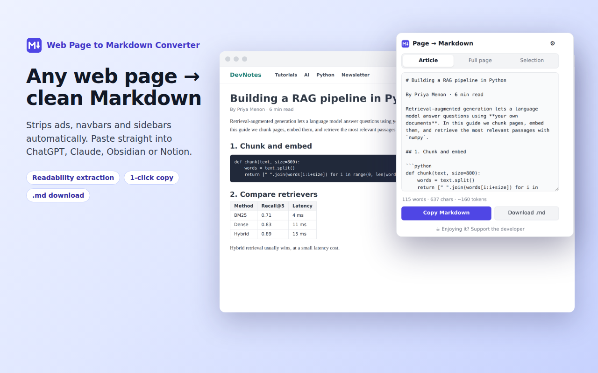

<p align="center"></p>
<h1 align="center">Web Page to Markdown Converter</h1>
<p align="center">A Chrome extension that turns any web page, article or selection into clean Markdown, for LLM prompts, Obsidian, Notion and GitHub. 100% local, ~50 KB, zero dependencies.</p>

<p align="center">
  <a href="https://chromewebstore.google.com/detail/fmbinlegholbmghcdbibjkdcbkcnolip">Chrome Web Store</a> ·
  <a href="../../issues/new/choose">Report a bug</a> ·
  <a href="docs/privacy.html">Privacy policy</a>
</p>



## Features
- **Article mode**: readability-style extraction that strips ads, navbars, sidebars, cookie banners and comments
- **Full page** and **Selection only** modes, including selections inside same-site iframes and text boxes
- **Right-click menu**: Copy selection as Markdown · Copy page as Markdown · Download full page as Markdown
- Code blocks keep their **language tags**, and line numbers and copy buttons are removed
- HTML tables become **GFM tables** (alignment, colspan, rowspan)
- Nested lists, task lists, blockquotes, footnotes, absolute image and link URLs, lazy-loaded images
- Options: image handling, inline or reference links, ``` or ~~~ fences, bullet style, title heading, **YAML front matter**
- Word, character and token counter · light and dark mode · shortcuts <kbd>Alt+Shift+M</kbd> / <kbd>Alt+Shift+C</kbd>

## Install
**From the Chrome Web Store:** [install here](https://chromewebstore.google.com/detail/fmbinlegholbmghcdbibjkdcbkcnolip).

**From source (developer mode):**
1. Download or clone this repo.
2. Open `chrome://extensions`, then enable **Developer mode**.
3. Click **Load unpacked** and select the `extension/` folder.

## Project structure
```
extension/
├── manifest.json        # Manifest V3
├── background.js        # Context menus, shortcuts, copy/download
├── turndown_parser.js   # Readability extraction + HTML→Markdown engine (no dependencies)
├── popup.html/.css/.js  # Preview, settings, copy & download UI
└── icons/
docs/                    # GitHub Pages support site + privacy policy
```

## Permissions
| Permission | Why |
|---|---|
| `activeTab` + `scripting` | Read the current tab only when you click the icon, menu or shortcut |
| `clipboardWrite` | Copy the Markdown to your clipboard |
| `contextMenus` | Right-click menu items |
| `storage` | Remember your formatting settings |

No host permissions, no remote code, no analytics. See the [privacy policy](docs/privacy.html).

## Support
- Help & FAQ: see the support site (GitHub Pages, `docs/` folder)
- Bugs and feature requests: [GitHub Issues](../../issues/new/choose)
- If it saves you time, you can [buy me a coffee via Razorpay](https://razorpay.me/@satishkumarjaiswal4142) ☕

## License
[MIT](LICENSE) © 2026 Satish Kumar Jaiswal
